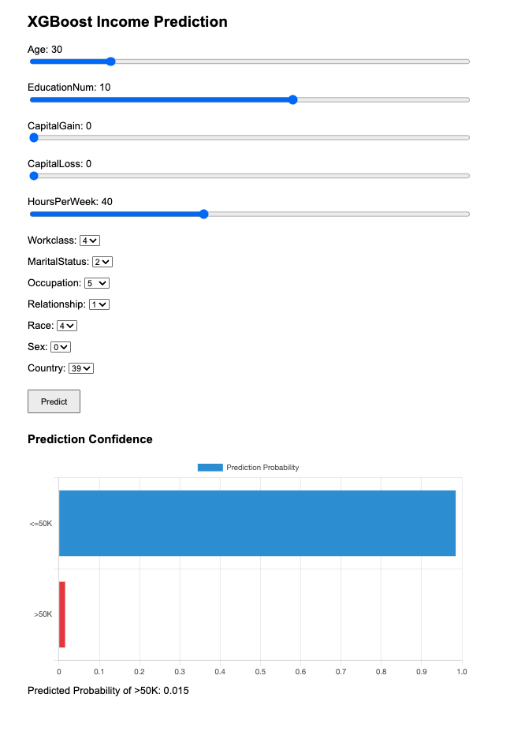

# XGBoost Income Prediction

This project is a web application that predicts income using an XGBoost model deployed on AWS SageMaker. It consists of a React frontend and a Flask backend.

## Features
- Interactive sliders and dropdowns for input features (age, education, capital gain/loss, hours per week, workclass, marital status, occupation, relationship, race, sex, country)
- Predict button to send data to the backend and receive predictions
- Backend connects to a SageMaker endpoint for inference

## Screenshot



## How to Run

### 1. Backend (Flask)
- Install dependencies:
	```bash
	pip install flask flask_cors sagemaker numpy
	```
- Start the Flask server:
	```bash
	python app.py
	```

### 2. Frontend (React)
- Install dependencies:
	```bash
	npm install
	```
- Start the React app:
	```bash
	npm start
	```

## API
- **POST /predict**: Accepts JSON `{ "features": [[...]] }` and returns predictions from SageMaker.

## Notes
- Ensure your SageMaker endpoint is running and accessible.
- CORS is enabled in the backend for local development.

---

For more details, see the code in `src/` (frontend) and `app.py` (backend).